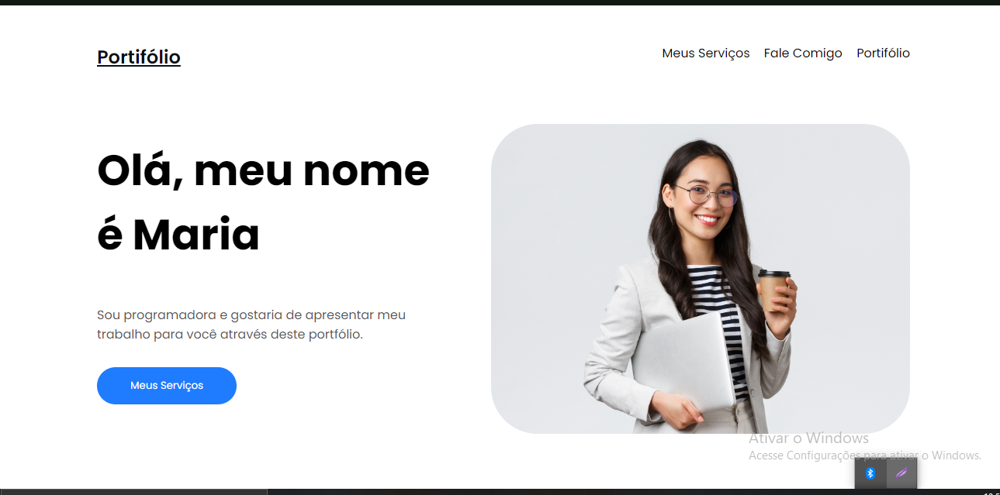

[HTML__BADGE]: https://img.shields.io/badge/html5-%23E34F26.svg?style=for-the-badge&logo=html5&logoColor=white
[CSS__BADGE]: https://img.shields.io/badge/css3-%231572B6.svg?style=for-the-badge&logo=css3&logoColor=white
[PROJECT__BADGE]: https://img.shields.io/badge/📱Visite_esse_projeto-000?style=for-the-badge&logo=project
[PROJECT__URL]: https://meu-portifolio-generico.netlify.app
[CHROME__URL]: https://www.google.com/chrome/dr/download/?brand=YTUH&ds_kid=43700077650614090&gad_source=1&gclid=Cj0KCQjwurS3BhCGARIsADdUH5167jbbhYJtsY6F3AVT8rrObpLIpiVZWD8Zy84x6tT5wKDHwt2-lRYaAo-7EALw_wcB&gclsrc=aw.ds 
[FIREFOX__URL]: https://mozilla-firefox.softonic.com.br
[OPERA__URL]: https://www.opera.com/pt-br/download

<h1 align="center" style="font-weight: bold;">Portifólio Genérico💻</h1>

![HTML5][HTML__BADGE]
![CSS3][CSS__BADGE]

<p align="center">
 <a href="#Sobre">Sobre</a> • 
 <a href="#started">Instruções de Uso</a> • 
</p>


<p align="center">
    
</p>

<h2 id="started">📌 Sobre</h2>

Este projeto é um portfólio dinâmico desenvolvido com HTML e CSS, estruturado para apresentar meus serviços e projetos de forma clara e organizada. 

- **Estrutura**: O layout utiliza um sistema de grid para facilitar a disposição de elementos, garantindo uma visualização responsiva em diferentes tamanhos de tela.
- **Navegação**: Um menu fixo permite fácil acesso às seções de serviços, portfólio e contato, melhorando a usabilidade.
- **Serviços**: A seção "Meus Serviços" detalha as ofertas, como consultoria, email marketing e criação de sites, com ícones representativos.
- **Contato**: Um formulário simples permite que os usuários insiram seus e-mails para um diagnóstico gratuito, facilitando a interação.
- **Portfólio**: Imagens ilustrativas dos projetos estão organizadas em uma seção dedicada, demonstrando as soluções criadas.

**Tecnologias utilizadas:**
- HTML
- CSS

[![project][PROJECT__BADGE]][PROJECT__URL]

<h2 id="started">🚀 Instruções de Uso</h2>

Aqui você discobrirá como rodar esse projeto localmente

<h3>Pré-requisitos</h3>

Aqui estão listados todos os pré-requisitos necessários para rodar meu projeto. Por exemplo:

- Um browser de sua prefêrencia ( Ex: [Chrome][CHROME__URL], [FireFox][FIREFOX__URL], [Opera][OPERA__URL]...)
- [Git](https://github.com)

<h3>Clonando para sua máquina</h3>

Como clonar esse projeto:

```bash
git clone https://github.com/CristaldoGui/portifolio-desafio.git
```

<h3>Rodando</h3>

Como rodar esse projeto?

1 - Clique com o botão direito no arquivo Index.html <br>
2 - Seleciona a opção "Abrir com..." ou "Open with..." <br>
3 - Escolha o browser de sua preferência
